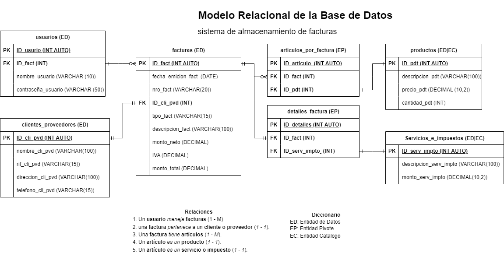

# Base de Datos

## Tablas
**Usuarios (ED)**
- ID_user **(PK)**
- nombre_user
- contraseña_user

**Facturas (ED)**
- id_fact **(PK)**
- fecha_emision
- numero_factura
- id_cliente_proveedor **(FK)**
- tipo
- descripcion 
- monto neto
- iva
- monto total

**Articulos_por_factura (EP)**
- id_articulo **(PK)**
- id_fact **(FK)**
- id_producto **(FK)**

**Clientes_Provedores (ED)**
- id_cliente_proveedor **(PK)**
- nombre
- rif
- dirección
- telefono

**Productos (ED)**
- id_producto **(PK)**
- descripcion
- precio
- cantidad

**Detalles_factura (EP)**
- id_detalles **(PK)**
- id_fact **(FK)**
- id_serv_impto **(FK)**

**Servicios_e_impuestos (ED)**
- ID_serv_impto **(PK)**
- nombre
- monto

## Relaciones
1. una factura _pertenece_ a un cliente o proveedor (relacion 1 a 1)
1.  una factura _tiene_  articulos
 (relacion 1 a muchos)
1. un articulo _es un_ producto (relacion 1 a 1)

 ## Diccionario

- **ED** entidad de Datos
- **EP** entidad Pivote
- **PK** llave primaria
- **FK** llave foranea

## Modelo Relacional de la BD
 

##  Reglas de Negocio

### clientes_proveedores
1. Crear un cliente.
1. Leer todos los clientes.
1. Leer un cliente en particular.
1. Actualizar un cliente.
1. Eliminar un cliente.

### productos
1. Crear un producto.
1. Leer todos los productos.
1. Leer un producto en particular.
1. Actualizar un producto.
1. Eliminar un producto.

### facturas
1. Crear una factura.
1. Leer todas las facturas.
1. Leer una factura en particular.
1. Leer todas las facturas de un cliente.
1. Leer todas las facturas de un producto.
1. Actualizar una factura.
1. Eliminar una factura.

### articulos_por_factura
1. Crear un artículo.
1. Leer todos los artículos.
1. Leer un artículo en particular.
1. Actualizar un artículo.
1. Eliminar un artículo.

## Generar la BD 
-- Crear BD
CREATE DATABASE caromack

-- Crear tablas

CREATE TABLE clientes_proveedores (
  ID_cli_pvd INT AUTO_INCREMENT PRIMARY KEY,
  nombre_cli_pvd VARCHAR(100) NOT NULL,
  rif_cli_pvd VARCHAR(15) NOT NULL,
  dirección_cli_pvd VARCHAR(100) NOT NULL,
  telefono_cli_pvd VARCHAR (11)
);

CREATE TABLE productos (
  ID_pdt INT AUTO_INCREMENT PRIMARY KEY,
  descripción_pdt VARCHAR(100) NOT NULL,
  precio_pdt DECIMAL(10,2) NOT NULL,
  cantidad_pdt INT  NOT NULL
);

CREATE TABLE servicios_e_impuestos (
  ID_serv_impto INT AUTO_INCREMENT PRIMARY KEY,
  descripcion_serv_impto VARCHAR(100) NOT NULL,
  monto_serv_impto DECIMAL(10,2)  NOT NULL
);

CREATE TABLE facturas (
    ID_fact INT AUTO_INCREMENT PRIMARY KEY,
    fecha_emision_fact DATE NOT NULL,
    nro_fact VARCHAR(20) NOT NULL,
    ID_cli_pvd INT NOT NULL,
    tipo_fact VARCHAR(15) NOT NULL,
    descripción_fact VARCHAR(100) NOT NULL,
    monto_neto INT NOT NULL,
    IVA INT NOT NULL,
    monto_total INT NOT NULL,
    is_deleted BOOLEAN NOT NULL,
    FOREIGN KEY (ID_cli_pvd) REFERENCES clientes_proveedores(ID_cli_pvd)
);

CREATE TABLE articulos_por_factura (
    ID_articulo INT AUTO_INCREMENT PRIMARY KEY,
    ID_fact INT NOT NULL,
    ID_pdt INT NOT NULL,
    FOREIGN KEY (ID_fact) REFERENCES facturas(ID_fact),
    FOREIGN KEY (ID_pdt) REFERENCES productos(ID_pdt)
);

CREATE TABLE detalles_factura (
    ID_detalles INT AUTO_INCREMENT PRIMARY KEY,
    ID_fact INT NOT NULL,
    ID_serv_impto INT NOT NULL,
    FOREIGN KEY (ID_fact) REFERENCES facturas(ID_fact),
    FOREIGN KEY (ID_serv_impto) REFERENCES servicios_e_impuestos(ID_serv_impto)
);
--     ID_fact INT NOT NULL,
CREATE TABLE Usuarios (
    id_usuario INT AUTO_INCREMENT PRIMARY KEY,
    nombre_usuario VARCHAR(10) NOT NULL UNIQUE,
    contraseña_usuario VARCHAR(50) NOT NULL,
    pregunta1 VARCHAR(50) NOT NULL,
    pregunta2 VARCHAR(50) NOT NULL
);

CREATE TABLE Sesiones (
    ID_sesion INT AUTO_INCREMENT PRIMARY KEY,
    ID_usuario INT NOT NULL,
    fecha_acceso DATETIME NOT NULL,
    fecha_salida DATETIME NOT NULL,
    FOREIGN KEY (ID_usuario) REFERENCES Usuarios(id_usuario)
);
